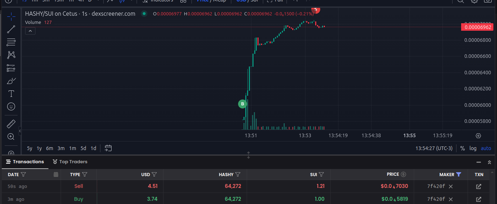
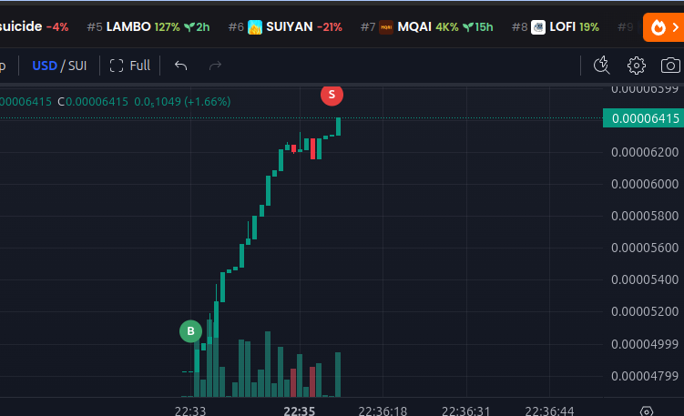

# SUI liquidity sniper

The bot monitors the creation of new pools. Once a pool is created, the bot automatically makes a purchase, logs the trade in the database, and starts a trading process that tracks the token's price fluctuations. When the desired profit is reached, or if the stop-loss rule is triggered, it automatically sells as well.

All actions will be sent on telegram chat by your bot.


## Screenshots

<div align="center">
  
</div>

<div align="center">
  
</div>

<div align="center">
  
</div>


## Env variables

Configure your .env with this credentials

`SUI_WALLET_SECRET_KEY`

`DATABASE_URL`

`TELEGRAM_TOKEN`

`TELEGRAM_GROUP_ID`

`SUIVISION_API_KEY`

get your free api key here: [blockvision](https://dashboard.blockvision.org/overview) 

*This API is only needed to retrieve information about the token creator, specifically to identify if spot bot wallets have created tokens used in scams by removing liquidity.*


## Running locally in dev mode.

clone the repo

```bash
  git clone https://github.com/AguaPotavel/sui-liquidity-sniper
```

go to folder

```bash
  cd my-project
```

Install deps

```bash
  npm install
```

Run migrations

```bash
  npx prisma migrate
```

Generate prisma client

```bash
  npx prisma generate
```

Run the project

```bash
  npm run dev
```

## Features

- Monitor new pool creations.
- Execute a purchase immediately after a pool is created.
- Detect and avoid honeypots.
- Track purchased tokens to identify the best selling opportunities.


## Dex support

- [x]  Cetus
- [x]  BlueMove
- [ ]  Bluefin
- [ ]  Turbos
- [ ]  FlowX

*Cetus is purchased directly on Cetus, while BlueMove uses 7k.agg to facilitate these transactions.* 

*The bot will only acquire tokens with liquidity created by the migrator from MovePump.*
## Authors

- @DirtySanch3z


## FAQ

#### Why is only supported BlueMove and Cetus?

Because tokens listed on Turbos, Bluefi, FlowX considerably less than in the other dex

#### Why is checked the owner of token?

Due to the prevalence of scam bots, they often create a token, provide liquidity, and then remove it as soon as users start buying the token, leaving buyers at a loss.


## Support

Feel free to support me: 0xd43c78676003e50b0e76360196656a1c3f050f5f960f35c80641600a267f420f


