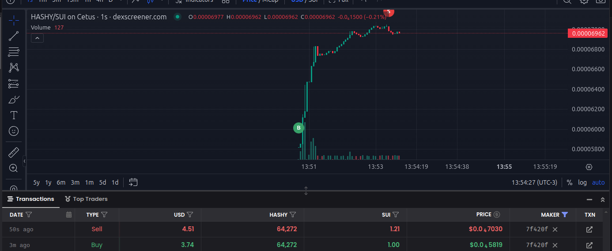
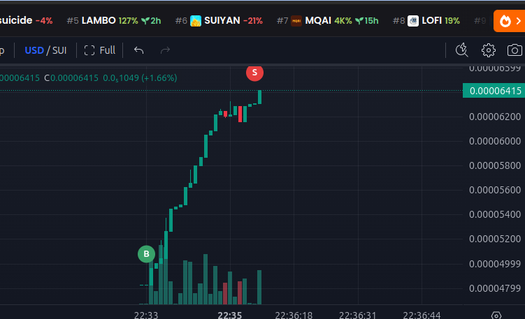

# SUI Liquidity Sniper

<<<<<<< HEAD
Ein fortschrittliches Tool zur Überwachung und Interaktion mit Liquiditätspools auf der SUI-Blockchain.

## Projektstruktur

Das Projekt besteht aus zwei Hauptkomponenten:

- **Backend**: Node.js-Server mit WebSocket-API für Echtzeit-Daten
- **Frontend**: Next.js-Anwendung für die Benutzeroberfläche

### Verzeichnisstruktur

```
sui-liquidity-sniper/
├── .env                  # Zentrale Umgebungsvariablen für Backend und Frontend
├── src/                  # Backend-Quellcode
│   ├── api/              # API-Endpunkte
│   ├── server/           # Server-Implementierung
│   └── utils/            # Hilfsfunktionen
├── web/                  # Frontend-Anwendung
│   ├── src/              # Frontend-Quellcode
│   │   ├── app/          # Next.js App Router
│   │   ├── components/   # React-Komponenten
│   │   └── lib/          # Frontend-Bibliotheken
│   └── public/           # Statische Assets
├── prisma/               # Datenbankschema und Migrationen
├── logs/                 # Anwendungslogs
└── backups/              # Automatische Backups
```

## Installation und Einrichtung

1. Repository klonen:
   ```bash
   git clone https://github.com/yourusername/sui-liquidity-sniper.git
   cd sui-liquidity-sniper
   ```

2. Abhängigkeiten installieren:
   ```bash
   npm install
   cd web
   npm install
   ```

3. Umgebungsvariablen konfigurieren:
   - Überprüfen Sie die `.env`-Datei im Hauptverzeichnis
   - Passen Sie die Werte nach Bedarf an

4. Datenbank initialisieren:
   ```bash
   npx prisma migrate dev
   ```

5. Backend starten:
   ```bash
   npm run start
   ```

6. Frontend starten (in einem separaten Terminal):
   ```bash
   cd web
   npm run dev
   ```

## Backup-System

Das Projekt verfügt über ein automatisches Backup-System, das wichtige Dateien sichert:

- Tägliche Backups werden im Verzeichnis `backups/YYYYMMDD/` gespeichert
- Einzelne Backup-Dateien haben die Erweiterung `.bak`

**Wichtig**: Löschen Sie keine Backup-Dateien, es sei denn, Sie sind sicher, dass sie nicht mehr benötigt werden. Es wird empfohlen, regelmäßig alte Backups zu archivieren und vom Produktionssystem zu entfernen, um Speicherplatz zu sparen.

## WebSocket-API

Die WebSocket-API ist der Hauptkommunikationskanal zwischen Backend und Frontend:

- **Verbindungs-URL**: `ws://localhost:3001` (Entwicklung) oder konfigurierte Produktions-URL
- **Ereignisse**:
  - `pools`: Liste der verfügbaren Liquiditätspools
  - `trades`: Echtzeit-Handelsdaten
  - `wallets`: Wallet-Informationen
  - `system`: Systemstatus und -metriken

## Umgebungsvariablen

Alle Konfigurationen werden in einer zentralen `.env`-Datei im Hauptverzeichnis verwaltet:

- Backend-Variablen: Direkt verfügbar
- Frontend-Variablen: Beginnen mit `NEXT_PUBLIC_`

Siehe die `.env`-Datei für eine vollständige Liste der verfügbaren Konfigurationsoptionen.

## Entwicklung

### Backend

```bash
npm run dev
```

### Frontend

```bash
cd web
npm run dev
```

## Produktion

Siehe die README-Datei im `web`-Verzeichnis für detaillierte Anweisungen zur Bereitstellung des Frontends in einer Produktionsumgebung.

Für das Backend:

```bash
npm run build
npm run start:prod
```

## Lizenz

Dieses Projekt ist urheberrechtlich geschützt. Alle Rechte vorbehalten.

=======
Ein leistungsstarkes Tool zum Snipen von Liquiditätspools auf der SUI-Blockchain.

>>>>>>> debdeb98eebd4a8a7697c3bfdb13b7717093acca
## Funktionen

- **Verbesserte Terminal-Ausgabe**: Klare und strukturierte Anzeige aller wichtigen Informationen
- **Echtzeit-Überwachung**: Automatische Erkennung neuer Pools und Benachrichtigungen
- **Fortschrittliche Filterung**: Intelligente Filterung von Pools basierend auf Risiko-Score, Liquidität und Honeypot-Erkennung
- **Benutzerfreundliche Befehle**: Einfache Befehle und Schnellzugriffstasten für alle Aktionen
- **Detaillierte Pool-Informationen**: Umfassende Informationen zu jedem Pool, einschließlich Social-Media-Links und Metriken
- **Automatischer Modus**: Automatisches Snipen von Pools, die den Filterkriterien entsprechen

<<<<<<< HEAD
## Neue Web-Oberfläche (In Entwicklung)

Wir entwickeln derzeit eine moderne Web-Oberfläche für den SUI Liquidity Sniper, die folgende Vorteile bietet:

- **Verbesserte Benutzerfreundlichkeit**: Intuitive Bedienung über eine grafische Benutzeroberfläche
- **Echtzeit-Dashboards**: Dynamische Dashboards mit Echtzeit-Daten und Visualisierungen
- **Responsive Design**: Optimiert für Desktop und mobile Geräte
- **Erweiterte Filteroptionen**: Visuelle Filter und Sortieroptionen für Pools
- **Detaillierte Analysen**: Umfassende Analysen und Grafiken für jeden Pool
- **Benachrichtigungen**: Browser-Benachrichtigungen für wichtige Ereignisse
- **Multi-Wallet-Unterstützung**: Verwaltung mehrerer Wallets in einer übersichtlichen Oberfläche
- **Dunkelmodus**: Augenschonender Dunkelmodus für nächtliche Nutzung

Die Web-Oberfläche wird mit modernen Technologien wie React, Next.js und TailwindCSS entwickelt und bietet eine nahtlose Integration mit der bestehenden Backend-Funktionalität.

### Vorschau der Web-Oberfläche

Die neue Web-Oberfläche wird folgende Hauptkomponenten enthalten:

1. **Dashboard**: Übersicht über alle wichtigen Metriken und aktuelle Aktivitäten
2. **Pool-Explorer**: Detaillierte Ansicht aller verfügbaren Pools mit Filterfunktionen
3. **Trading-Bereich**: Verwaltung von Trades mit Echtzeit-Charts und Analysen
4. **Wallet-Manager**: Verwaltung von Wallets und Transaktionen
5. **Einstellungen**: Anpassung von Filterkriterien und Benachrichtigungen
6. **Analysen**: Detaillierte Analysen und Statistiken zu Pools und Trades
=======
## Installation

```bash
# Klone das Repository
git clone https://github.com/yourusername/sui-liquidity-sniper.git

# Wechsle in das Verzeichnis
cd sui-liquidity-sniper

# Installiere die Abhängigkeiten
npm install

# Starte die Anwendung
npm run cli
```
>>>>>>> debdeb98eebd4a8a7697c3bfdb13b7717093acca

## Befehle und Schnellzugriffstasten

| Befehl | Schnelltaste | Beschreibung |
|--------|--------------|--------------|
| `help` | `h` | Zeigt die Hilfe an |
| `clear` | `c` | Löscht den Bildschirm |
| `status` | `s` | Zeigt den aktuellen Status an |
| `pools` | `p` | Zeigt alle aktiven Pools an |
| `details <poolId>` | - | Zeigt Details zu einem Pool an |
| `buy <poolId> <amount>` | - | Kauft Token aus einem Pool |
| `sell <poolId> <amount>` | - | Verkauft Token aus einem Pool |
| `auto on` | `a` | Schaltet den Auto-Modus ein |
| `auto off` | `x` | Schaltet den Auto-Modus aus |
| `risk` | `r` | Zeigt Risikoanalyse für alle Pools |
| `filter` | `f` | Zeigt und ändert Filtereinstellungen |
| `quickbuy` | `qb` | Kauft automatisch den besten Pool |
| `quicksell` | `qs` | Verkauft alle gekauften Token |
| `wallet` | `w` | Zeigt Wallet-Informationen |
| `scan` | - | Scannt aktiv nach neuen Pools |
| `monitor <on|off>` | - | Schaltet Pool-Überwachung ein/aus |
| `exit` | `q` | Beendet das Programm |

## Parameter

- `minliquidity` - Minimale Liquidität in SUI
- `maxrisk` - Maximaler Risiko-Score (0-100)
- `size` - Positionsgröße in SUI
- `takeprofit` - Take-Profit in Prozent
- `stoploss` - Stop-Loss in Prozent
- `trailingstop` - Trailing-Stop aktivieren/deaktivieren (on/off)
- `trailingdistance` - Trailing-Distanz in Prozent

## Verbesserte Terminal-Ausgabe

Die Terminal-Ausgabe wurde vollständig überarbeitet, um eine bessere Übersicht und Benutzerfreundlichkeit zu gewährleisten:

1. **Strukturierte Anzeige**: Alle Informationen werden in klar strukturierten Tabellen und Boxen angezeigt
2. **Farbkodierung**: Wichtige Informationen werden farblich hervorgehoben
3. **Detaillierte Pool-Informationen**: Umfassende Informationen zu jedem Pool, einschließlich:
   - Token-Informationen (Name, Symbol, Adresse)
   - Liquiditätsinformationen
   - Risiko-Metriken (Scam-Wahrscheinlichkeit, Honeypot-Erkennung)
   - Social-Media-Links
   - Handelsstatistiken
4. **Echtzeit-Benachrichtigungen**: Sofortige Benachrichtigungen bei neuen Pools
5. **Benutzerfreundliche Eingabe**: Verbesserte Eingabeaufforderung mit Befehlshistorie und Schnellzugriffstasten

## Schnellzugriff auf wichtige Funktionen

Mit den neuen Schnellzugriffstasten können Sie sofort auf die wichtigsten Funktionen zugreifen:

1. **Risikoanalyse (r)**: Zeigt eine detaillierte Risikoanalyse aller aktiven Pools mit farblicher Hervorhebung
2. **Filtereinstellungen (f)**: Zeigt die aktuellen Filtereinstellungen und ermöglicht deren schnelle Änderung
3. **Schnellkauf (qb)**: Kauft automatisch den besten verfügbaren Pool basierend auf Risiko und Liquidität
4. **Schnellverkauf (qs)**: Verkauft alle gekauften Token mit einem Befehl
5. **Wallet-Informationen (w)**: Zeigt alle wichtigen Informationen zu Ihrer Wallet auf einen Blick

## Lizenz

MIT


## Screenshots

<div align="center">
  
</div>

<div align="center">
  
</div>

<div align="center">
  
</div>


## Env variables

Configure your .env with this credentials

`SUI_WALLET_SECRET_KEY`

`DATABASE_URL`

`TELEGRAM_TOKEN`

`TELEGRAM_GROUP_ID`

`SUIVISION_API_KEY`

get your free api key here: [blockvision](https://dashboard.blockvision.org/overview) 

*This API is only needed to retrieve information about the token creator, specifically to identify if spot bot wallets have created tokens used in scams by removing liquidity.*


## Running locally in dev mode.

clone the repo

```bash
  git clone https://github.com/AguaPotavel/sui-liquidity-sniper
```

go to folder

```bash
  cd my-project
```

Install deps

```bash
  npm install
```

Run migrations

```bash
  npx prisma migrate
```

Generate prisma client

```bash
  npx prisma generate
```

Run the project

```bash
  npm run dev
```

## Features

- Monitor new pool creations.
- Execute a purchase immediately after a pool is created.
- Detect and avoid honeypots.
- Track purchased tokens to identify the best selling opportunities.


## Dex support

- [x]  Cetus
- [x]  BlueMove
- [ ]  Bluefin
- [ ]  Turbos
- [ ]  FlowX

*Cetus is purchased directly on Cetus, while BlueMove uses 7k.agg to facilitate these transactions.* 

*The bot will only acquire tokens with liquidity created by the migrator from MovePump.*
## Authors

- @DirtySanch3z


## FAQ

#### Why is only supported BlueMove and Cetus?

Because tokens listed on Turbos, Bluefi, FlowX considerably less than in the other dex

#### Why is checked the owner of token?

Due to the prevalence of scam bots, they often create a token, provide liquidity, and then remove it as soon as users start buying the token, leaving buyers at a loss.


## Upcoming Features

### Performance-Optimierungen
Integration von Mysticeti V2, das schnellere Transaktionsverarbeitung ermöglicht6

Anpassung an Remora, die neue horizontale Skalierungslösung von SUI, die hundertausende Transaktionen pro Sekunde verarbeiten kann6

Implementierung der neuen "Programmable Peer-to-Peer Tunnels" für reduzierte Latenzzeiten6

### DEX-Integration
Erweiterung um neue DEXs wie Steamm von Suilend4

Anpassung an die verbesserte Kapitaleffizienz durch neue "Bank"-Features4

Integration der neuen yield-bearing LP Token Funktionalität4

### Sicherheitsupdates
Implementierung der neuen Zero-Knowledge Proofs für verbesserte Privatsphäre6

Aktualisierung der Honeypot-Erkennung für neue Scam-Muster1

Erweiterung der Gas-Preis-Optimierung gemäß SIP-45 für Hochlastzeiten4

Wallet-Funktionalität
Integration der neuen Phantom und Backpack Wallet-Funktionen4

Verbesserung der Multi-Wallet-Verwaltung für bis zu 40 Wallets1

Implementierung verbesserter Backup- und Sicherheitsprotokolle8

Diese Updates werden schrittweise implementiert werden, um die Stabilität des Bots zu gewährleisten und von den neuen SUI-Blockchain-Funktionen optimal zu profitieren.

